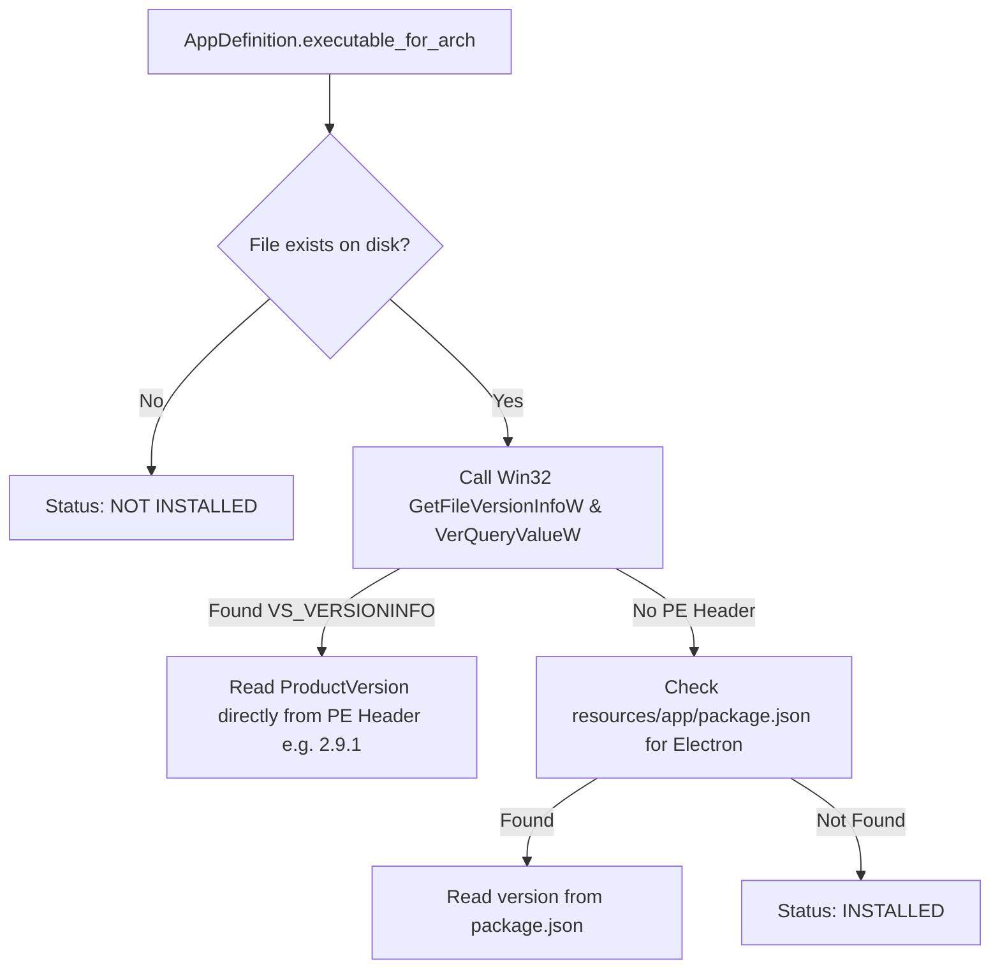

# Architecture & Engineering Manual: `ppm` (Portable Package Manager)

This document provides a comprehensive technical overview of the **`ppm` (Portable Package Manager)** virtualization suite.

---

## 1. Executive Summary

`ppm` is a 100% native Rust, zero-dependency master runner and multi-architecture package manager distributed as a **pure single executable (`ppm.exe`)**. It eliminates host file-system pollution, host registry tampering, and process interference by implementing **canonical Windows NT user profile virtualization** combined with **lowest-boundary system call detours** and **declarative multi-architecture package management**.

```mermaid
graph TD
    subgraph Single Binary Distribution Product (USB Flash Drive)
        PPM[ppm.exe - Master Binary at Root]
        PPMDir[".ppm/ (apps.json, system/, lib/, cache/, logs/)"]
        HomeDir["Home/ (Pure %USERPROFILE% & %HOME% - Zero .ppm files)"]
        BatLaunchers["Clean Root .bat Shortcuts (antigravity.bat, antigravity-manager.bat)"]

        subgraph Apps/ Top-Level Architecture
            X64Dir["Apps/x64/ (Intel / AMD 64-bit Binaries)"]
            ARM64Dir["Apps/arm64/ (Snapdragon / Surface ARM64 Binaries)"]
        end
    end

    PPM -->|ppm init| PPMDir & X64Dir & ARM64Dir & HomeDir & BatLaunchers
    PPM -->|ppm install <app>| DepResolver[Resolves Dependencies via DAG -> Installs to Apps/arch/target_dir]
    PPM -->|ppm run <app>| HostDetect[Detects Host CPU via GetNativeSystemInfo]
    HostDetect -->|Routes to Apps/host_arch/target_dir| Virtualize[Injects .ppm/lib/redirector.dll & Spawns Target App]
    PPM -->|ppm link| BatLaunchers
```

---

## 2. The Directory Model

```
<USB_ROOT>/
├── ppm.exe                             # Master CLI & Runner (Single Standalone Binary ~4.7 MB)
├── antigravity.bat                     # 1-Click Launchers (@start "" "%~dp0ppm.exe" run antigravity)
├── antigravity-manager.bat
│
├── .ppm/                               # [PPM INTERNAL MACHINERY & ENGINE DATA]
│   ├── apps.json                       # Declarative application manifest (Root config for easy access)
│   ├── apps.schema.json                # Auto-Generated JSON Schema
│   │
│   ├── system/                         # [VIRTUAL SYSTEM OVERLAYS]
│   │   ├── registry.json               # Virtual Copy-on-Write Registry Hive (Zero Host Writes)
│   │   └── credentials.json            # Virtual Windows Credential Vault (Encrypted)
│   │
│   ├── lib/                            # [INTERNAL ENGINE BINARIES]
│   │   └── redirector.dll              # Injected Win32 Virtualization & Detours Engine
│   │
│   ├── cache/                          # [TEMPORARY DOWNLOAD ARTIFACTS]
│   │   └── (Auto-cleaned temporary download archives during install/update)
│   │
│   └── logs/                           # [DIAGNOSTIC LOG HUB]
│       ├── ppm.log                     # Package Manager & Downloader Log
│       └── redirector.log              # Real-Time Win32 API Interception Trace
│
├── Apps/                               # [TOP-LEVEL MULTI-ARCHITECTURE APPLICATION BINARIES]
│   ├── x64/                            # [INTEL / AMD 64-BIT BINARIES]
│   │   ├── Antigravity/                # Google Antigravity IDE (Antigravity.exe)
│   │   ├── AntigravityManager/         # Antigravity Tools Manager (Antigravity Tools.exe)
│   │   └── WebView2/                   # Microsoft Edge WebView2 (msedge.exe)
│   └── arm64/                          # [QUALCOMM SNAPDRAGON / SURFACE ARM64 BINARIES]
│       ├── Antigravity/                # Native ARM64 Antigravity IDE
│       └── WebView2/                   # Native ARM64 WebView2
│
└── Home/                               # [100% PURE USER PROFILE - ZERO PPM INTERNAL FILES]
    ├── AppData/
    │   ├── Local/                      # %LOCALAPPDATA% (App caches, GPU shaders, LevelDB)
    │   ├── Roaming/                    # %APPDATA% (Antigravity user settings, extensions)
    │   └── WebViewData/                # %WEBVIEW2_USER_DATA_FOLDER%
    ├── Documents/                      # User documents folder
    └── ...                             # User code workspaces, git repos, dotfiles (.gitconfig, .ssh)
```

---

## 3. Lowest-Boundary User-Mode Virtualization Matrix (`redirector.dll`)

```
┌───────────────────────────────────────────────────────────────────────────────────────────────────┐
│                                 THE LOWEST-LEVEL BOUNDARY MAP                                     │
├──────────────────────┬───────────────────────────────┬────────────────────────────────────────────┤
│ Subsystem            │ Lowest User-Mode Boundary     │ Why This is the Absolute Lowest Point      │
├──────────────────────┼───────────────────────────────┼────────────────────────────────────────────┤
│ 1. Registry (CoW)    │ ntdll.dll (Nt*Key)            │ The single user-mode chokepoint to kernel  │
│ 2. Process Spawning  │ kernelbase.dll (CreateProcInternalW) │ Catches CreateProcessA/W/AsUser/Tokens     │
│ 3. Credentials       │ advapi32.dll / vaultcli.dll   │ Chokepoint before leaving process via ALPC │
│ 4. Shell Paths       │ shell32.dll + ntdll.dll       │ COM Shell cache + NT Registry User Shell   │
│ 5. Taskbar Identity  │ shell32.dll                   │ User-mode Application Frame Host boundary  │
└──────────────────────┴───────────────────────────────┴────────────────────────────────────────────┘
```

| Target API | Interception Layer | CoW Virtualization Role |
| :--- | :--- | :--- |
| **`NtOpenKey` / `NtOpenKeyEx`** | `ntdll.dll` | Normalizes NT object paths (`\Registry\User\...`, `\Registry\Machine\...`); registers handle in `VirtualHandleTable`. |
| **`NtCreateKey`** | `ntdll.dll` | Creates key in portable overlay; registers virtual handle. |
| **`NtQueryValueKey`** | `ntdll.dll` | Checks virtual overlay and tombstones; falls back to host OS for pass-through reads. |
| **`NtSetValueKey`** | `ntdll.dll` | **The CoW Engine**: Stores typed value in memory, persists to `.ppm/system/registry.json`, returns `STATUS_SUCCESS` with **zero host registry write**. |
| **`NtDeleteValueKey` / `NtDeleteKey`** | `ntdll.dll` | Records tombstones in virtual store; masks host key/value. |
| **`NtClose`** | `ntdll.dll` | Cleans up synthetic handles from `VirtualHandleTable`. |
| **`CreateProcessW` / `CreateProcessInternalW`** | `kernelbase.dll` | Injects `redirector.dll` into 100% of child processes via Microsoft Detours. |
| **`CredReadW`, `CredWriteW`, `CredDeleteW`** | `advapi32.dll` | In-process ALPC credential interception; saves to `.ppm/system/credentials.json`. |
| **`SHGetKnownFolderPath`** | `shell32.dll` | Redirects `FOLDERID_Profile`, `FOLDERID_LocalAppData`, `FOLDERID_RoamingAppData`, `FOLDERID_Documents` to `<root>\Home\...`. |
| **`GetUserProfileDirectoryW`** | `userenv.dll` | Writes `<root>\Home` into the destination buffer. |
| **`SetCurrentProcessExplicitAppUserModelID`** | `shell32.dll` | Forces AppUserModelID to `Google.Antigravity.Portable`. |

---

## 4. Dynamic Presence-Based Version Engine

We completely eliminate `state.json`. `ppm` inspects local executables on disk dynamically:



---

## 5. Domain-Driven Modular Source Tree

### A. `crates/redirector/src/`
```
crates/redirector/src/
├── lib.rs                          # DLL Entrypoint & Hook Lifecycle Orchestration
├── paths.rs                        # Canonical Path Configurations (Home/, .ppm/logs/, .ppm/system/)
│
├── registry/                       # [PILLAR 1: ntdll.dll Copy-on-Write Registry]
│   ├── mod.rs                      # Registry module export & initialization
│   ├── nt_types.rs                 # UNICODE_STRING, OBJECT_ATTRIBUTES, KeyInfo, NTSTATUS
│   ├── store.rs                    # In-Memory Virtual Hive & Atomic JSON Persistence (.ppm/system/registry.json)
│   ├── handle_table.rs             # Thread-Safe Virtual HKEY Handle Table
│   └── hooks.rs                    # ntdll.dll System Call Detours (Nt*Key, NtClose)
│
├── process/                        # [PILLAR 2: kernelbase.dll Process Spawning]
│   ├── mod.rs                      # Process module export & initialization
│   └── hooks.rs                    # CreateProcessInternalW & CreateProcessW Detours
│
├── credentials/                    # [PILLAR 3: advapi32.dll Pre-ALPC Credentials]
│   ├── mod.rs                      # Credentials module export & initialization
│   ├── vault.rs                    # Encrypted JSON Credential Vault (.ppm/system/credentials.json)
│   └── hooks.rs                    # CredReadW, CredWriteW, CredDeleteW, CredFree Detours
│
└── shell/                          # [PILLAR 4: shell32.dll / userenv.dll Shell & Taskbar]
    ├── mod.rs                      # Shell module export & initialization
    ├── folders.rs                  # SHGetKnownFolderPath, GetUserProfileDirectoryW
    └── taskbar.rs                  # SetCurrentProcessExplicitAppUserModelID & ARGB "P" Icon
```

### B. `crates/ppm/src/`
```
crates/ppm/src/
├── main.rs                         # CLI Entrypoint & Subcommand Dispatch
│
├── core/                           # [CORE DOMAIN]
│   ├── mod.rs
│   ├── arch.rs                     # CpuArch, ArchTarget & Win32 CPU Detection (GetNativeSystemInfo)
│   ├── config.rs                   # AppManifests, AppDefinition, ArchString (serde/schemars)
│   └── assets.rs                   # Embedded redirector.dll & default apps.json
│
├── engine/                         # [ENGINE DOMAIN]
│   ├── mod.rs
│   ├── init.rs                     # Scaffolding (.ppm/system, .ppm/lib, .ppm/cache, .ppm/logs, Apps/, Home/)
│   ├── runner.rs                   # Detours process runner & environment injection
│   └── launcher.rs                 # Dynamic root .bat launcher generator
│
└── package/                        # [PACKAGE DOMAIN]
    ├── mod.rs
    ├── pe_info.rs                  # Dynamic Win32 PE version extractor (GetFileVersionInfoW)
    ├── version.rs                  # Remote version checker & dynamic presence resolver (Zero state.json)
    ├── downloader.rs               # Streaming HTTP downloader with progress bar
    ├── extractor.rs                # NSIS 7z, 7z, Zip, Cab, MSI, Tar, Binary unpacker
    └── sanitizer.rs                # Post-install auto-updater removal & cleanup
```

---

## 6. Developer Build Workflow

To compile the entire suite and produce the single-binary release artifact:

```bash
# 100% Native Cargo Build
cargo build --release
```

**Build Output**: `target/release/ppm.exe` (~4.7 MB). This single binary is the only file required for end-user distribution. It self-provisions `.ppm/`, extracts embedded `redirector.dll`, and scaffolds the entire portable environment upon running `ppm.exe init`.
