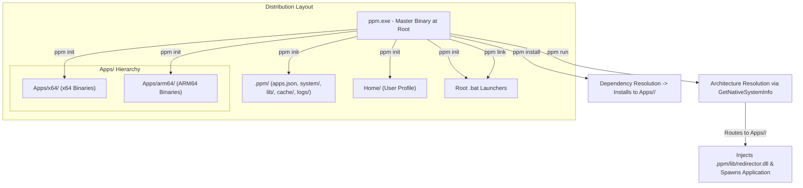
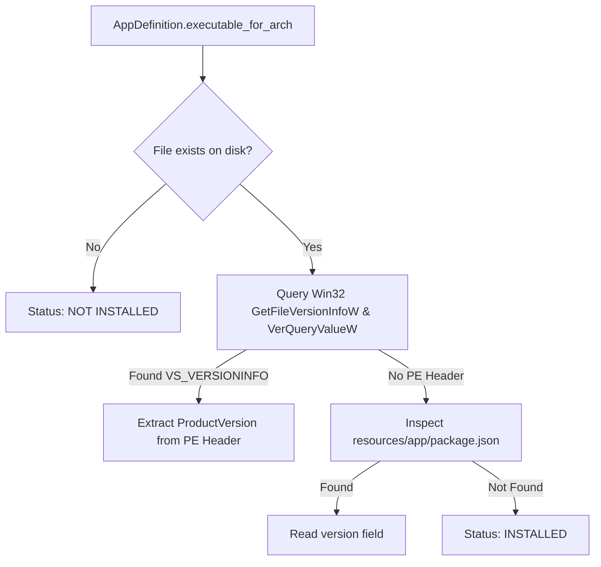

# Architecture Manual: `ppm` (Portable Package Manager)

Technical specification and architectural design of the `ppm` virtualization suite.

---

## 1. System Overview

`ppm` is a native Windows application runner and package manager. It implements user profile virtualization, system call detours, and multi-architecture package resolution.



---

## 2. Directory Layout

```
<USB_ROOT>/
├── ppm.exe                             # Master CLI & Runner
├── antigravity.bat                     # Application Launchers
├── antigravity-manager.bat
│
├── .ppm/                               # Engine runtime data
│   ├── apps.json                       # Declarative application manifest
│   ├── apps.schema.json                # Generated JSON Schema
│   │
│   ├── system/                         # Virtual overlays
│   │   ├── registry.json               # Virtual registry hive
│   │   └── credentials.json            # Encrypted credential store
│   │
│   ├── lib/                            # Runtime libraries
│   │   └── redirector.dll              # Injected virtualization library
│   │
│   ├── cache/                          # Download cache
│   │   └── ...
│   │
│   └── logs/                           # Runtime logs
│       ├── ppm.log
│       └── redirector.log
│
├── Apps/                               # Multi-architecture binaries
│   ├── x64/                            # x64 Application Binaries
│   │   ├── Antigravity/
│   │   ├── AntigravityManager/
│   │   └── WebView2/
│   └── arm64/                          # ARM64 Application Binaries
│       ├── Antigravity/
│       └── WebView2/
│
└── Home/                               # User Profile
    ├── AppData/
    │   ├── Local/                      # %LOCALAPPDATA%
    │   ├── Roaming/                    # %APPDATA%
    │   └── WebViewData/                # %WEBVIEW2_USER_DATA_FOLDER%
    ├── Documents/
    └── ...
```

---

## 3. User-Mode Virtualization Matrix (`redirector.dll`)

```
┌────────────────────────────────────────────────────────────────────────────────────────┐
│                                   VIRTUALIZATION BOUNDARIES                             │
├──────────────────────┬───────────────────────────────┬─────────────────────────────────┤
│ Subsystem            │ Interception Boundary         │ Scope & Target DLL              │
├──────────────────────┼───────────────────────────────┼─────────────────────────────────┤
│ 1. Registry (CoW)    │ advapi32.dll + ntdll.dll      │ Win32 Registry APIs + NT Syscalls│
│ 2. Process Spawning  │ kernelbase.dll / kernel32.dll │ CreateProcessW                  │
│ 3. Credentials       │ advapi32.dll                  │ CredReadW / CredWriteW / Delete │
│ 4. Shell Paths       │ shell32.dll + userenv.dll     │ Known Folders / Profile Paths   │
│ 5. Taskbar Identity  │ shell32.dll                   │ SetCurrentProcessExplicitAppId  │
└──────────────────────┴───────────────────────────────┴─────────────────────────────────┘
```

| Target API | Interception Layer | Virtualization Function |
| :--- | :--- | :--- |
| **`RegOpenKeyExW` / `NtOpenKey`** | `advapi32.dll` / `ntdll.dll` | Normalizes registry paths (`HKCU\...`, `\Registry\User\...`); tracks handle in `VirtualHandleTable`. |
| **`RegCreateKeyExW` / `NtCreateKey`** | `advapi32.dll` / `ntdll.dll` | Creates key in virtual overlay; registers handle in `VirtualHandleTable`. |
| **`RegQueryValueExW` / `NtQueryValueKey`** | `advapi32.dll` / `ntdll.dll` | Queries virtual overlay and tombstones; falls back to host OS for unshadowed reads. |
| **`RegSetValueExW` / `NtSetValueKey`** | `advapi32.dll` / `ntdll.dll` | Stores typed value in memory and atomically persists to `.ppm/system/registry.json`. |
| **`RegDeleteValueW` / `RegDeleteKeyW` / `NtDelete*`** | `advapi32.dll` / `ntdll.dll` | Records tombstones in virtual store, masking host values. |
| **`RegCloseKey` / `NtClose`** | `advapi32.dll` / `ntdll.dll` | Cleans up handles in `VirtualHandleTable`. |
| **`CreateProcessW` / `CreateProcessInternalW`** | `kernelbase.dll` / `kernel32.dll` | Injects `redirector.dll` into spawned child processes via Microsoft Detours. |
| **`CredReadW`, `CredWriteW`, `CredDeleteW`** | `advapi32.dll` | Intercepts credentials and persists to encrypted `.ppm/system/credentials.json`. |
| **`SHGetKnownFolderPath`** | `shell32.dll` | Redirects `FOLDERID_Profile`, `FOLDERID_LocalAppData`, `FOLDERID_RoamingAppData`, `FOLDERID_Documents` to `<root>\Home\...`. |
| **`GetUserProfileDirectoryW`** | `userenv.dll` | Returns `<root>\Home` as user profile directory. |
| **`SetCurrentProcessExplicitAppUserModelID`** | `shell32.dll` | Maps application model ID to isolated portable domain. |

---

## 4. Version Resolution Engine

`ppm` inspects local executables on disk dynamically without maintaining intermediate state files:



---

## 5. Source Tree Layout

### A. `crates/redirector/src/`
```
crates/redirector/src/
├── lib.rs                          # DLL Entrypoint & Hook Orchestration
├── paths.rs                        # Path Resolution (Home/, .ppm/logs/, .ppm/system/)
├── detour.rs                       # Microsoft Detours FFI Wrapper
│
├── registry/                       # Registry Virtualization
│   ├── mod.rs                      # Registry module export & initialization
│   ├── nt_types.rs                 # UNICODE_STRING, OBJECT_ATTRIBUTES, NTSTATUS definitions
│   ├── store.rs                    # In-Memory Hive & Atomic JSON Persistence (.ppm/system/registry.json)
│   ├── handle_table.rs             # Virtual Handle Table & Pseudo-Handle Mapping
│   └── hooks.rs                    # Win32 (advapi32) + NT (ntdll) Detour Hooks
│
├── process/                        # Process Virtualization
│   ├── mod.rs                      # Process module export & initialization
│   └── hooks.rs                    # CreateProcessW Detour Hook
│
├── credentials/                    # Credential Store Virtualization
│   ├── mod.rs                      # Credentials module export & initialization
│   ├── vault.rs                    # Encrypted Credential Vault (.ppm/system/credentials.json)
│   └── hooks.rs                    # Cred* API Detours
│
└── shell/                          # Shell & Profile Virtualization
    ├── mod.rs                      # Shell module export & initialization
    ├── folders.rs                  # SHGetKnownFolderPath, GetUserProfileDirectoryW
    └── taskbar.rs                  # SetCurrentProcessExplicitAppUserModelID Detour
```

### B. `crates/ppm/src/`
```
crates/ppm/src/
├── main.rs                         # CLI Entrypoint & Subcommand Dispatch
│
├── core/                           # Core Domain
│   ├── mod.rs
│   ├── arch.rs                     # CpuArch, ArchTarget & Win32 CPU Detection (GetNativeSystemInfo)
│   ├── config.rs                   # AppManifests, AppDefinition (serde/schemars)
│   └── assets.rs                   # Embedded redirector.dll & default apps.json
│
├── engine/                         # Engine Domain
│   ├── mod.rs
│   ├── init.rs                     # Workspace Scaffolding (.ppm/, Apps/, Home/)
│   ├── runner.rs                   # Process Execution & Win32 Argument Quoting
│   └── launcher.rs                 # Launcher Script Generator
│
└── package/                        # Package Domain
    ├── mod.rs
    ├── pe_info.rs                  # PE Version Header Extractor (GetFileVersionInfoW)
    ├── version.rs                  # Version Resolution & Update Checking
    ├── downloader.rs               # HTTP Downloader with Progress Reporting
    ├── extractor.rs                # Archive Extractor (7z, Zip, Tar, MSI)
    └── sanitizer.rs                # Post-Install Cleanup
```

### C. `crates/test-probe/src/` & Integration Tests
```
crates/test-probe/src/
└── main.rs                         # Verification binary testing Registry, Shell, Vault & Injection

crates/ppm/tests/
└── e2e_virtualization.rs           # Integration test executing test-probe under ppm run
```

---

## 6. Build & Test Workflow

```bash
# Run unit and integration test suite
cargo test --workspace

# Run static analysis and clippy lints
cargo clippy --workspace --all-targets

# Compile release binary
cargo build --release
```

**Build Output**: `target/release/ppm.exe`.
